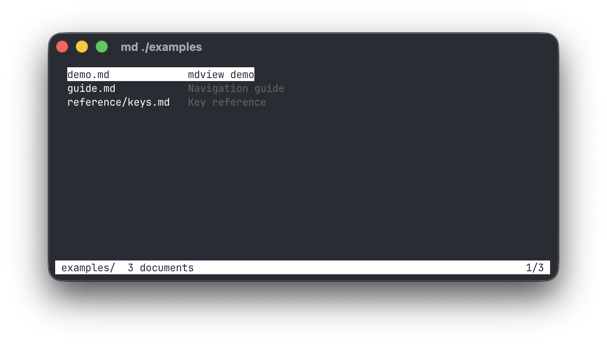
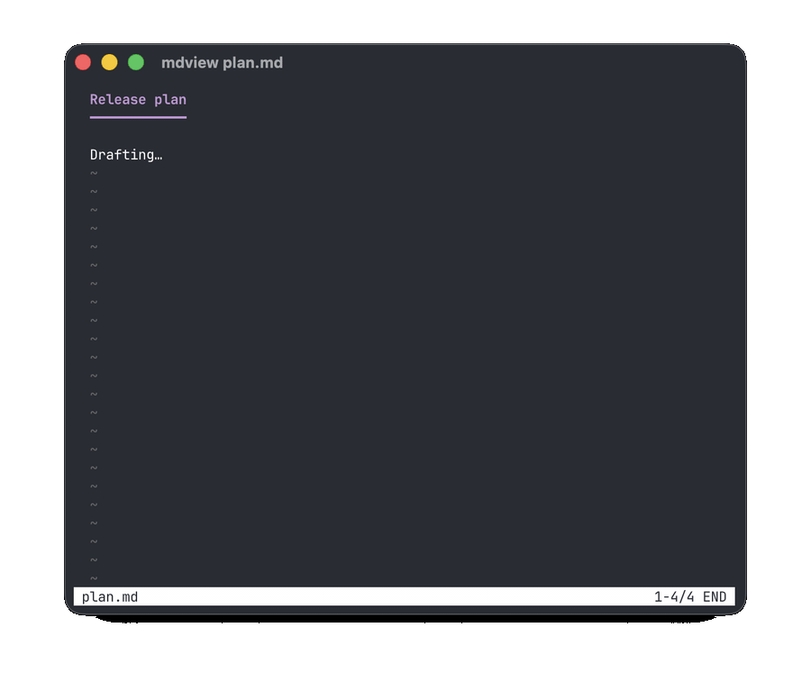

# mdview

A `less`-style terminal pager that renders markdown readably.

```sh
mdview README.md
mdview docs/                        # browse a directory of documents
curl -s https://example.com/notes.md | mdview
```

Headings are colored and indexed, paragraphs are reflowed to a configurable
width, fenced code blocks are syntax-highlighted, tables get a full
box-drawing grid with a double rule under the header, GitHub-style admonitions (`> [!NOTE]`, `> [!WARNING]`, …) get colored
bars and titles, and links are emitted as OSC 8 hyperlinks (clickable in
iTerm2, Ghostty, WezTerm, kitty, and friends). Local images render inline at
full resolution in any terminal that implements the kitty graphics protocol
with Unicode placeholders (kitty and Ghostty among them — mdview probes the
terminal at startup rather than checking names, so protocol-capable terminals
work automatically); other terminals see a clickable link instead. Images
never hold up the text: they are decoded and scaled to the display size in the
background and streamed to the terminal between keystrokes, on-screen ones
first, so a document full of multi-megabyte screenshots opens instantly. This
works inside tmux too, once passthrough is on (see [tmux](#tmux)).

Long table cells wrap onto extra lines instead of being cut off (`w` switches
to compact one-line rows). The file is watched while you read: when an editor
or an agent writes to it, the view re-renders in place and keeps your scroll
position. `--width 0` wraps at the full terminal width and re-wraps as you
resize, which makes a tmux pane behave like a live preview.


| Admonitions | Diagrams & math (```` ```mermaid ````, ```` ```latex ````) |
|---|---|
|  |  |

| Syntax-highlighted code | Lists & task lists |
|---|---|
|  |  |

| Tables | Inline images (kitty graphics — mdview showing its own README) |
|---|---|
|  |  |

## Directory mode

Point mdview at a directory and it lists every markdown document underneath
it, with each file's first heading alongside. `j`/`k` move, `Enter` opens a
document, and `q` brings you back to the list; `q` on the list quits. The
list refreshes itself as files appear, so a folder an agent is filling with
notes can be left open and browsed as it grows.



Piped, `mdview docs/ | cat` prints the same listing as plain text, one
`path<TAB>title` per line.

## Live reload

Open a document once and leave it open. Every time the file is saved, by
you in an editor or by an agent writing it, mdview re-reads it and re-renders
in place, keeping your scroll position and search. A markdown file being
written by a coding agent becomes a live preview: no quitting, no reopening,
no losing your place.



It's on by default; set `hot_reload = false` in the config file to freeze the
view at open time.

## Installing

Shell installer (macOS or Linux, no toolchain needed):

```sh
curl --proto '=https' --tlsv1.2 -LsSf https://github.com/landonturner/mdview/releases/latest/download/mdview-installer.sh | sh
```

With [mise](https://mise.jdx.dev) (verifies SLSA build provenance):

```sh
mise use -g github:landonturner/mdview@latest
```

With [nix](https://nixos.org) (flakes):

```sh
nix run github:landonturner/mdview            # try it
nix profile install github:landonturner/mdview
```

Or from source: `cargo install --git https://github.com/landonturner/mdview`

## tmux

Inline images work inside tmux 3.3 or newer, but tmux blocks the graphics
escape sequences unless you allow them through. Add this to `~/.tmux.conf`
and restart tmux (or run it as a `tmux set -g` command):

```
set -g allow-passthrough on
```

mdview detects tmux and wraps its image transfers in tmux's passthrough
envelope; the placeholder cells that position the image are ordinary text, so
scrolling, splits, and detach/attach keep working. Without passthrough, images
fall back to a clickable link.

## Building

The Rust toolchain is pinned via [mise](https://mise.jdx.dev) (`mise.toml`):

```sh
mise install
cargo build --release   # or: mise exec -- cargo build --release
```

## Keys

| Key            | Action                              |
|----------------|-------------------------------------|
| `j` / `k`, arrows | scroll one line                  |
| `SPACE` / `b`  | page down / up                      |
| `d` / `u`      | half page down / up                 |
| `g` / `G`      | top / bottom (`42g` → line 42)      |
| `50p`          | go to 50%                           |
| `/` / `?`      | search forward / backward (smartcase substring) |
| `n` / `N`      | next / previous match               |
| `]` / `[`      | next / previous heading             |
| `t`            | table of contents overlay           |
| `v`            | toggle diagrams rendered / as source |
| `w`            | toggle table cells wrapped / compact |
| `o`            | follow a link (hint labels appear)  |
| `Backspace` / `ctrl-o` | back to the previous document |
| `h`            | help                                |
| `q`            | quit (from a document opened out of a directory list: back to the list) |
| `Enter`        | open the selected document (directory list) |

Counts work like less: `10j`, `5k`, `42g`.

`t` opens the table of contents; `h` shows the key reference:

| `t` — table of contents | `h` — help |
|---|---|
|  |  |

## Options

```
-w, --width <N>   reflow paragraphs to at most N columns (this run only);
                  0 or `auto` wraps at the terminal width, re-wrapping on resize
-d, --dump        print the rendered document (with ANSI styling) and exit
-c, --config      open the config file in $EDITOR
    --clear-cache delete the rendered-diagram cache (mermaid/LaTeX)
```

When stdout is not a terminal, mdview prints the rendered document as plain
text instead of paging, so `mdview foo.md | grep …` behaves sensibly.

## Configuration

Settings live in `~/.config/mdview/config.toml` (honoring `$XDG_CONFIG_HOME`).
`mdview --config` opens it in `$VISUAL`/`$EDITOR` (falling back to `vi`),
seeding it with a commented template on first use and validating it when the
editor closes:

```toml
# Paragraphs reflow to at most this many columns (capped at the terminal
# width). 0 wraps at the full terminal width and re-wraps on resize.
wrap_width = 120

# Blank columns at the left edge (shrinks to 0 on very narrow terminals).
left_margin = 2

# "auto" detects the terminal background (OSC 11); or force "dark" / "light".
# Drives the default code theme, link color, and mermaid/LaTeX colors.
theme = "auto"

# Code-block theme; unset matches the terminal theme. Any syntect default:
#   base16-ocean.dark, base16-eighties.dark, base16-mocha.dark,
#   base16-ocean.light, InspiredGitHub, Solarized (dark), Solarized (light)
# code_theme = "base16-ocean.dark"

# How mermaid/latex blocks start out: "rendered" diagrams, or their "text"
# source (toggle with v).
default_view = "rendered"

# Re-render when the file changes on disk, keeping the scroll position.
hot_reload = true

# Long table cells: "wrap" onto extra lines, or "compact" (one line, cut with …).
table_view = "wrap"
```

All keys are optional; `--width` overrides the file.

`table_view = "wrap"` (the default) folds long table cells onto extra lines so
nothing is cut off; `"compact"` keeps one line per row and trims overflow with
`…`. Either way, `w` in the pager switches between the two.

`hot_reload = true` (the default) makes mdview re-read the file whenever it
changes on disk and re-render in place, keeping your scroll position, so a
document being written by an editor or an agent stays current without
reopening it. Set it to `false` to freeze the view at open time.
