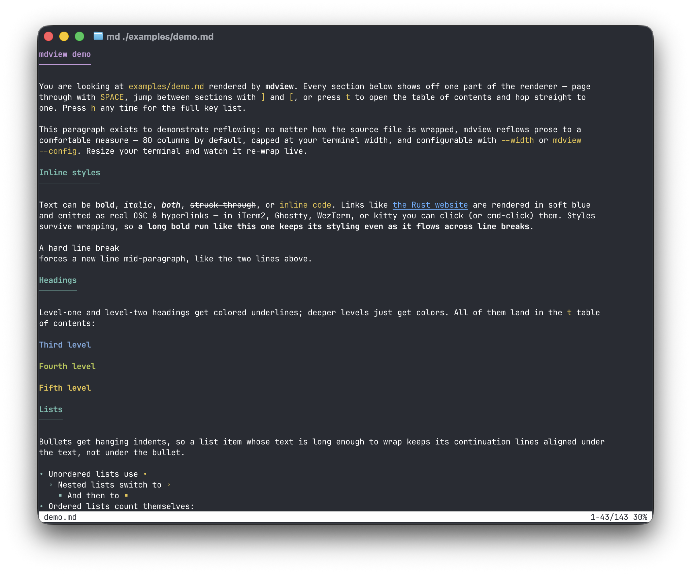
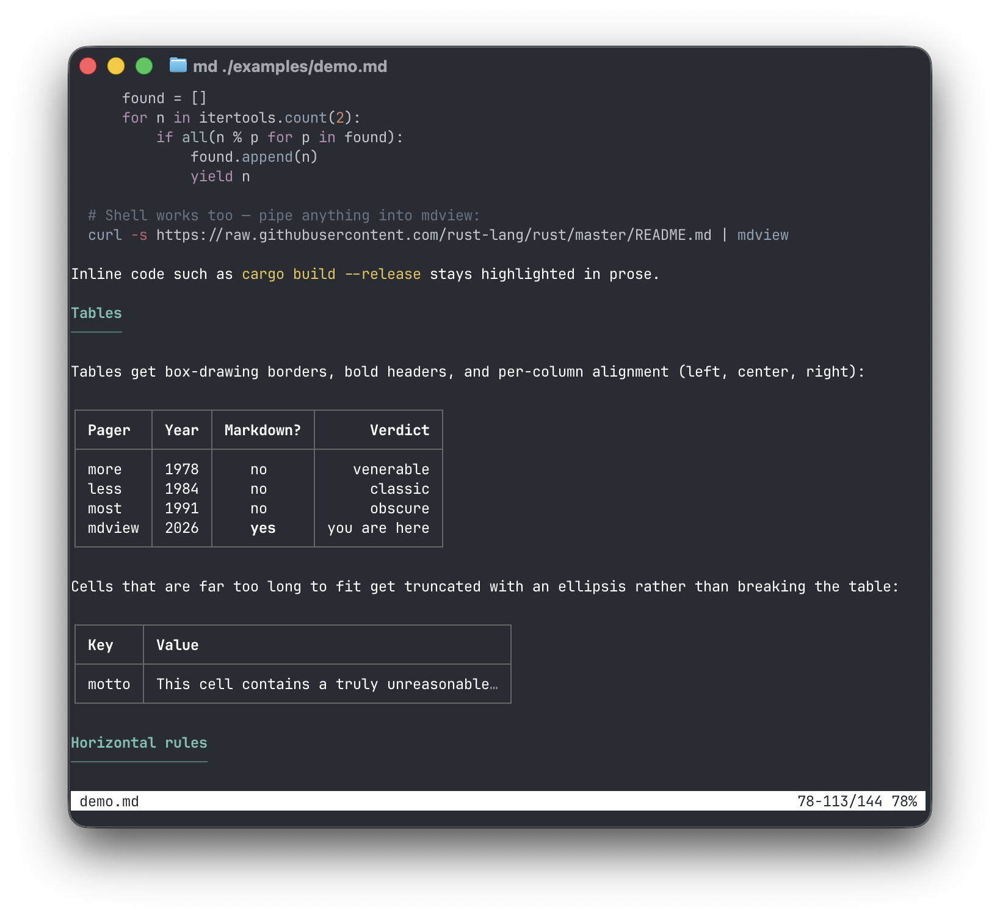
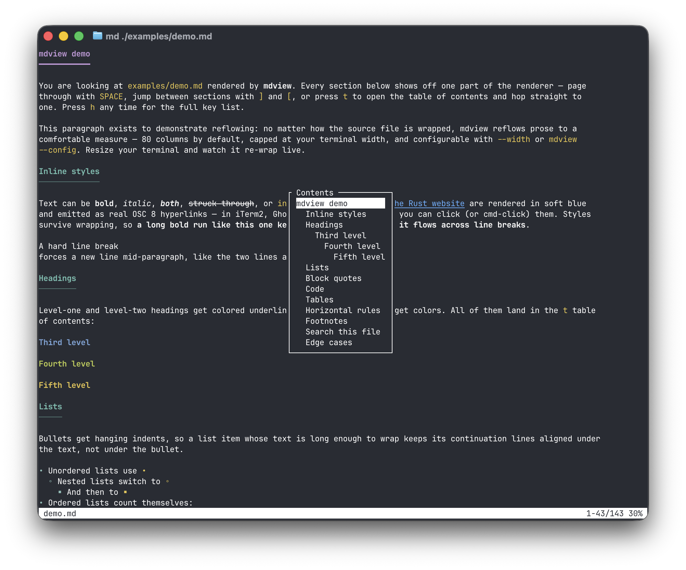
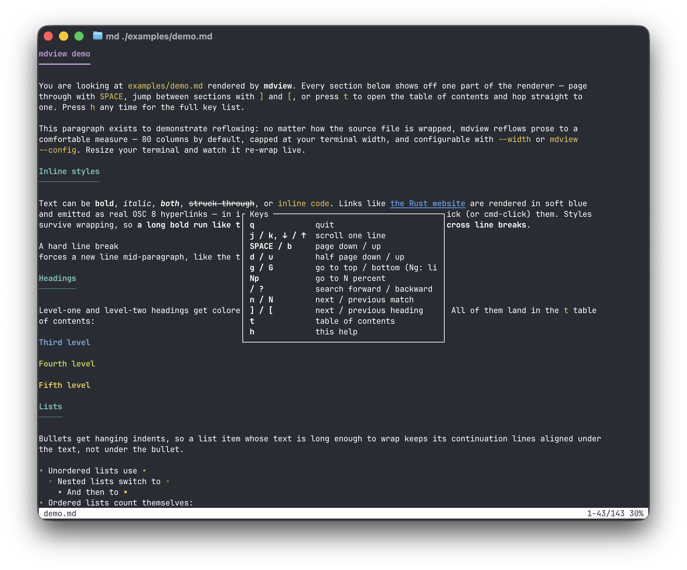

# mdview

A `less`-style terminal pager that renders markdown readably.

```sh
mdview README.md
curl -s https://example.com/notes.md | mdview
```

Headings are colored and indexed, paragraphs are reflowed to a configurable
width, fenced code blocks are syntax-highlighted, tables get box-drawing
borders, and links are emitted as OSC 8 hyperlinks (clickable in iTerm2,
Ghostty, WezTerm, kitty, and friends).





## Building

The Rust toolchain is pinned via [mise](https://mise.jdx.dev) (`mise.toml`):

```sh
mise install
cargo build --release   # or: mise exec -- cargo build --release
```

## Keys

| Key            | Action                              |
|----------------|-------------------------------------|
| `j` / `k`, arrows | scroll one line                  |
| `SPACE` / `b`  | page down / up                      |
| `d` / `u`      | half page down / up                 |
| `g` / `G`      | top / bottom (`42g` → line 42)      |
| `50p`          | go to 50%                           |
| `/` / `?`      | search forward / backward (smartcase substring) |
| `n` / `N`      | next / previous match               |
| `]` / `[`      | next / previous heading             |
| `t`            | table of contents overlay           |
| `h`            | help                                |
| `q`            | quit                                |

Counts work like less: `10j`, `5k`, `42g`.

`t` opens the table of contents; `h` shows the key reference:

| `t` — table of contents | `h` — help |
|---|---|
|  |  |

## Options

```
-w, --width <N>   reflow paragraphs to at most N columns (this run only)
-d, --dump        print the rendered document (with ANSI styling) and exit
-c, --config      open the config file in $EDITOR
```

When stdout is not a terminal, mdview prints the rendered document as plain
text instead of paging, so `mdview foo.md | grep …` behaves sensibly.

## Configuration

Settings live in `~/.config/mdview/config.toml` (honoring `$XDG_CONFIG_HOME`).
`mdview --config` opens it in `$VISUAL`/`$EDITOR` (falling back to `vi`),
seeding it with a commented template on first use and validating it when the
editor closes:

```toml
# Paragraphs reflow to at most this many columns (capped at the terminal width).
wrap_width = 80

# Any syntect default theme: base16-ocean.dark, base16-eighties.dark,
# base16-mocha.dark, base16-ocean.light, InspiredGitHub, Solarized (dark),
# Solarized (light)
code_theme = "base16-ocean.dark"
```

Both keys are optional; `--width` overrides the file.
