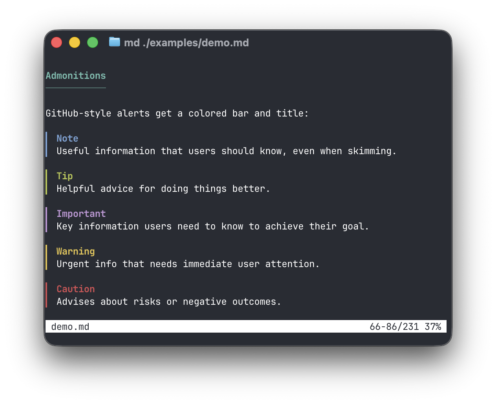
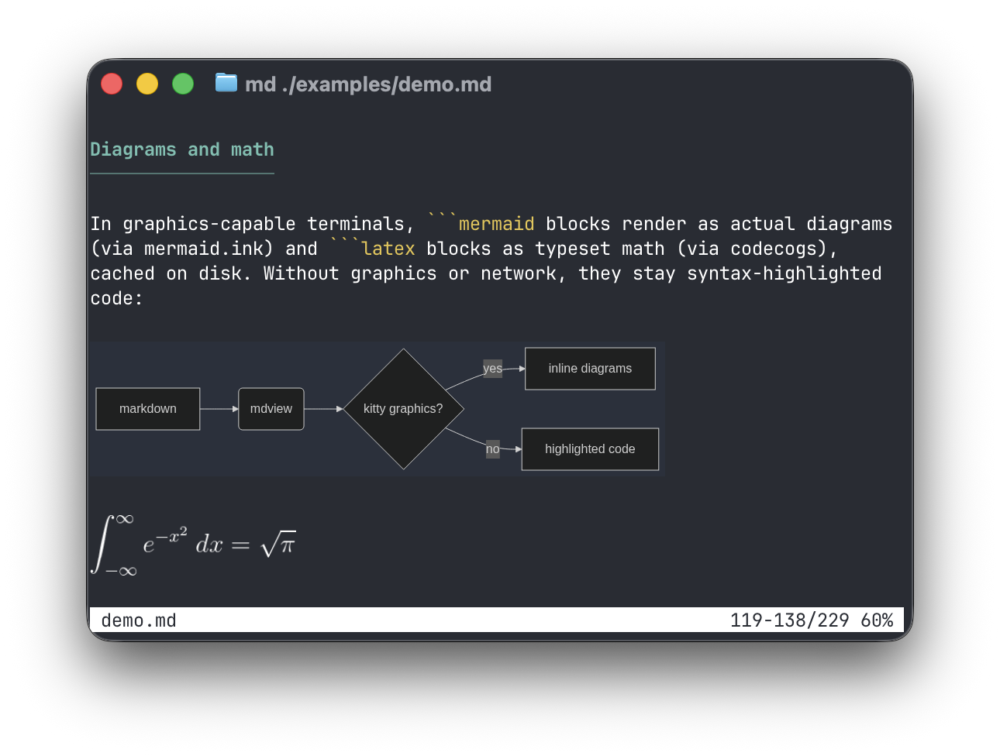
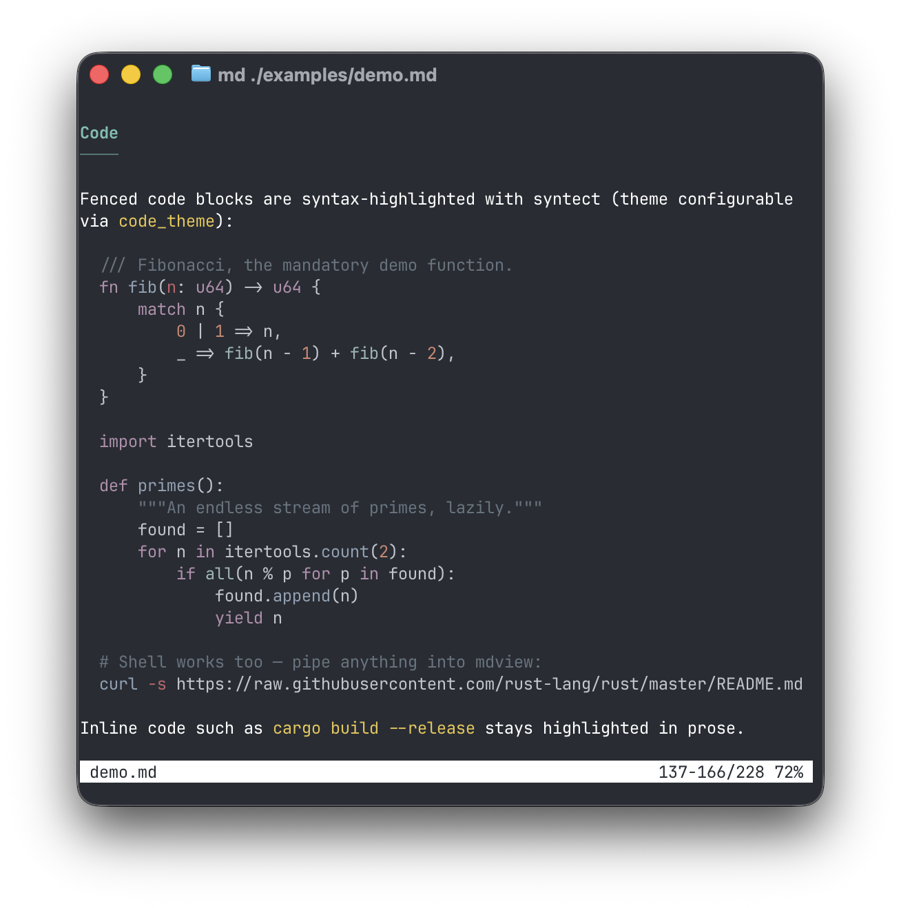
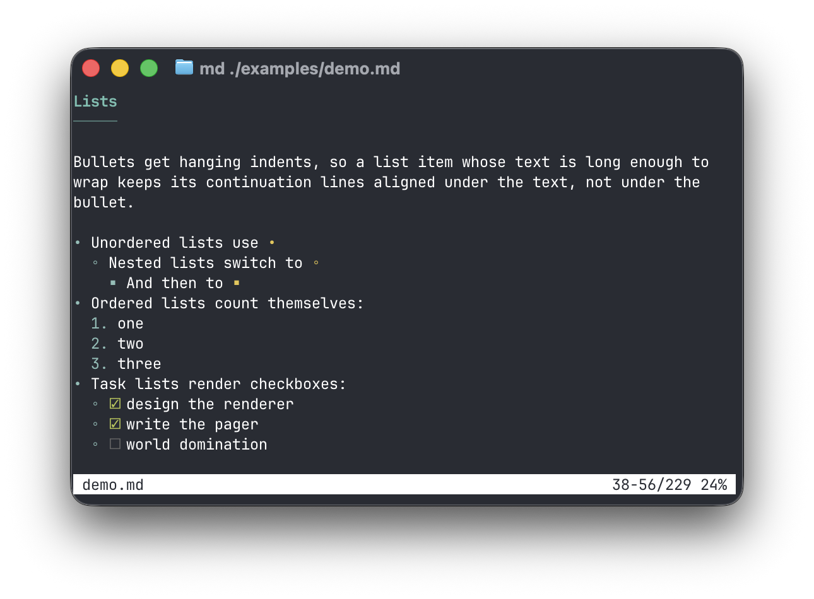
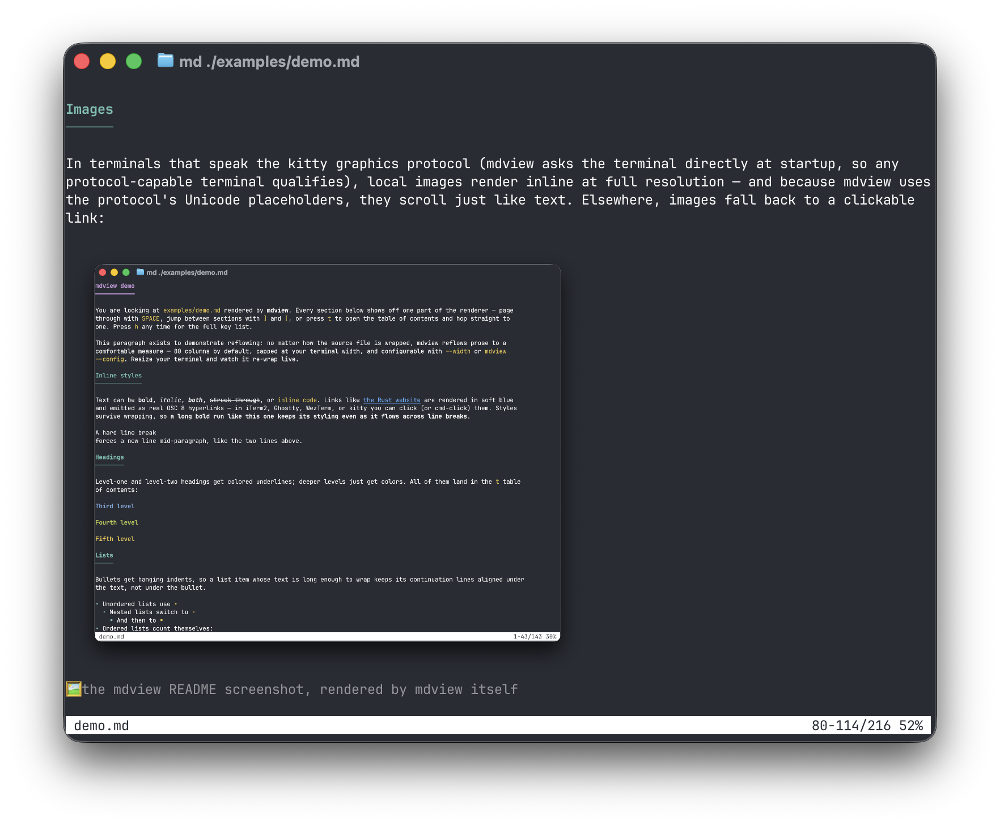

# mdview

A `less`-style terminal pager that renders markdown readably.

```sh
mdview README.md
curl -s https://example.com/notes.md | mdview
```

Headings are colored and indexed, paragraphs are reflowed to a configurable
width, fenced code blocks are syntax-highlighted, tables get box-drawing
borders, GitHub-style admonitions (`> [!NOTE]`, `> [!WARNING]`, …) get colored
bars and titles, and links are emitted as OSC 8 hyperlinks (clickable in
iTerm2, Ghostty, WezTerm, kitty, and friends). Local images render inline at
full resolution in any terminal that implements the kitty graphics protocol
with Unicode placeholders (kitty and Ghostty among them — mdview probes the
terminal at startup rather than checking names, so protocol-capable terminals
work automatically); other terminals see a clickable link instead.


| Admonitions | Diagrams & math (```` ```mermaid ````, ```` ```latex ````) |
|---|---|
|  |  |

| Syntax-highlighted code | Lists & task lists |
|---|---|
|  |  |


And in kitty-protocol terminals, images render inline — here is mdview
displaying its own README screenshot:



## Building

The Rust toolchain is pinned via [mise](https://mise.jdx.dev) (`mise.toml`):

```sh
mise install
cargo build --release   # or: mise exec -- cargo build --release
```

## Keys

| Key            | Action                              |
|----------------|-------------------------------------|
| `j` / `k`, arrows | scroll one line                  |
| `SPACE` / `b`  | page down / up                      |
| `d` / `u`      | half page down / up                 |
| `g` / `G`      | top / bottom (`42g` → line 42)      |
| `50p`          | go to 50%                           |
| `/` / `?`      | search forward / backward (smartcase substring) |
| `n` / `N`      | next / previous match               |
| `]` / `[`      | next / previous heading             |
| `t`            | table of contents overlay           |
| `v`            | toggle diagrams rendered / as source |
| `h`            | help                                |
| `q`            | quit                                |

Counts work like less: `10j`, `5k`, `42g`.

`t` opens the table of contents; `h` shows the key reference:

| `t` — table of contents | `h` — help |
|---|---|
|  |  |

## Options

```
-w, --width <N>   reflow paragraphs to at most N columns (this run only)
-d, --dump        print the rendered document (with ANSI styling) and exit
-c, --config      open the config file in $EDITOR
    --clear-cache delete the rendered-diagram cache (mermaid/LaTeX)
```

When stdout is not a terminal, mdview prints the rendered document as plain
text instead of paging, so `mdview foo.md | grep …` behaves sensibly.

## Configuration

Settings live in `~/.config/mdview/config.toml` (honoring `$XDG_CONFIG_HOME`).
`mdview --config` opens it in `$VISUAL`/`$EDITOR` (falling back to `vi`),
seeding it with a commented template on first use and validating it when the
editor closes:

```toml
# Paragraphs reflow to at most this many columns (capped at the terminal width).
wrap_width = 80

# Any syntect default theme: base16-ocean.dark, base16-eighties.dark,
# base16-mocha.dark, base16-ocean.light, InspiredGitHub, Solarized (dark),
# Solarized (light)
code_theme = "base16-ocean.dark"

# How mermaid/latex blocks start out: "rendered" diagrams, or their "text"
# source (toggle with v).
default_view = "rendered"
```

All keys are optional; `--width` overrides the file.
