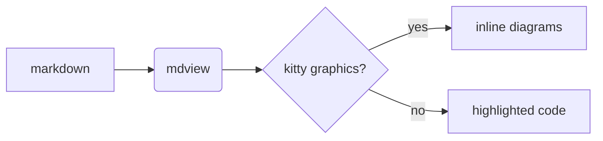

# mdview demo

You are looking at `examples/demo.md` rendered by **mdview**. Every section
below shows off one part of the renderer — page through with `SPACE`, jump
between sections with `]` and `[`, or press `t` to open the table of contents
and hop straight to one. Press `h` any time for the full key list.

This paragraph exists to demonstrate reflowing: no matter how the source file
is wrapped, mdview reflows prose to a comfortable measure — 80 columns by
default, capped at your terminal width, and configurable with `--width` or
`mdview --config`. Resize your terminal and watch it re-wrap live.

## Inline styles

Text can be **bold**, *italic*, ***both***, ~~struck through~~, or `inline
code`. Links like [the Rust website](https://www.rust-lang.org) are rendered
in soft blue and emitted as real OSC 8 hyperlinks — in iTerm2, Ghostty,
WezTerm, or kitty you can click (or cmd-click) them. Styles survive wrapping,
so **a long bold run like this one keeps its styling even as it flows across
line breaks**.

A hard line break\
forces a new line mid-paragraph, like the two lines above.

GitHub emoji shortcodes render as real emoji: :book: :rocket: :tada:
:sparkles: — but stay literal in code, like `:book:`.

## Links you can follow

Press `o` right now: labels appear on every visible link, and the next
keypress follows one. Markdown files open in place — `Backspace` brings you
back here, scroll position intact.

- Start the tour: [the navigation guide](guide.md)
- Jump into a subdirectory: [the key reference](reference/keys.md)
- Land mid-file: [the searching section](reference/keys.md#searching)
- Stay in this document: [the tables section](#tables)
- Leave the terminal: [pulldown-cmark](https://github.com/pulldown-cmark/pulldown-cmark)

## Headings

Level-one and level-two headings get colored underlines; deeper levels just
get colors. All of them land in the `t` table of contents:

### Third level

#### Fourth level

##### Fifth level

## Lists

Bullets get hanging indents, so a list item whose text is long enough to wrap
keeps its continuation lines aligned under the text, not under the bullet.

- Unordered lists use `•`
  - Nested lists switch to `◦`
    - And then to `▪`
- Ordered lists count themselves:
  1. one
  2. two
  3. three
- Task lists render checkboxes:
  - [x] design the renderer
  - [x] write the pager
  - [ ] world domination

## Block quotes

> Block quotes get a colored bar down the left edge. Long quoted paragraphs
> wrap inside the bar, and blank lines inside the quote keep the bar too.
>
> > Quotes nest — each level adds another bar.

## Admonitions

GitHub-style alerts get a colored bar and title:

> [!NOTE]
> Useful information that users should know, even when skimming.

> [!TIP]
> Helpful advice for doing things better.

> [!IMPORTANT]
> Key information users need to know to achieve their goal.

> [!WARNING]
> Urgent info that needs immediate user attention.

> [!CAUTION]
> Advises about risks or negative outcomes.

## Images

In terminals that speak the kitty graphics protocol (mdview asks the
terminal directly at startup, so any protocol-capable terminal qualifies),
local images render inline at full resolution — and because mdview uses the
protocol's Unicode placeholders, they scroll just like text. Elsewhere,
images fall back to a clickable link:


## Diagrams and math

In graphics-capable terminals, ```` ```mermaid ```` blocks render as actual
diagrams (via mermaid.ink) and ```` ```latex ```` blocks as typeset math (via
codecogs), cached on disk. Without graphics or network, they stay
syntax-highlighted code:



```latex
\int_{-\infty}^{\infty} e^{-x^2}\,dx = \sqrt{\pi}
```

## Code

Fenced code blocks are syntax-highlighted with syntect (theme configurable
via `code_theme`):

```rust
/// Fibonacci, the mandatory demo function.
fn fib(n: u64) -> u64 {
    match n {
        0 | 1 => n,
        _ => fib(n - 1) + fib(n - 2),
    }
}
```

```python
import itertools

def primes():
    """An endless stream of primes, lazily."""
    found = []
    for n in itertools.count(2):
        if all(n % p for p in found):
            found.append(n)
            yield n
```

```sh
# Shell works too — pipe anything into mdview:
curl -s https://raw.githubusercontent.com/rust-lang/rust/master/README.md | mdview
```

Inline code such as `cargo build --release` stays highlighted in prose.

## Tables

Tables get box-drawing borders, bold headers, and per-column alignment
(left, center, right):

| Pager    | Year | Markdown? |     Verdict |
|:---------|:----:|:---------:|------------:|
| more     | 1978 |    no     |  venerable |
| less     | 1984 |    no     |    classic |
| most     | 1991 |    no     |    obscure |
| mdview   | 2026 |  **yes**  | you are here |

Cells that are far too long to fit get truncated with an ellipsis rather than
breaking the table:

| Key | Value |
|-----|-------|
| motto | This cell contains a truly unreasonable amount of text so that you can see the ellipsis truncation behavior in action |

## Horizontal rules

Three dashes become a full-width rule:

---

## Footnotes

Footnotes are linked by reference[^1] and rendered where they are
defined[^2].

[^1]: This is the first footnote's text.
[^2]: And the second — with a hanging indent so longer footnote text wraps
    neatly under the marker.

## Search this file

Try it now: press `/` and type `needle`, then `n` to cycle matches. Here is a
needle, and here is another needle, and — hidden in this sentence — one final
needle. Searching is smartcase: all-lowercase queries ignore case, while a
query with a capital letter (`Needle`) matches exactly.

## Edge cases

Absurdly long unbreakable tokens are hard-wrapped instead of overflowing:

Supercalifragilisticexpialidocious-pneumonoultramicroscopicsilicovolcanoconiosis-antidisestablishmentarianism-floccinaucinihilipilification

Wide characters (CJK, emoji) are measured properly: 日本語のテキストも正しく折り返されます。 🎉

*The end — press `g` to jump back to the top, or `q` to quit.*
